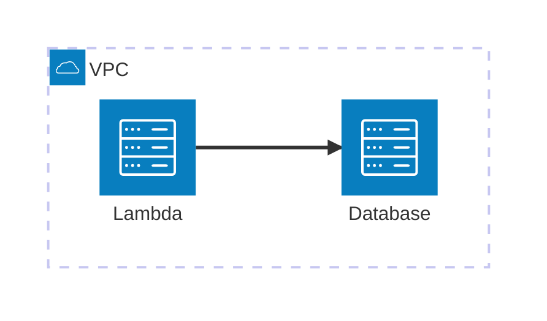

# LocalStack Kubernetes Integration Demo

This repo contains a demo of LocalStack running in Kubernetes. The demo includes:

- A MySQL database
- A Lambda function that connects to the database and performs a demonstration query
- Terraform code to deploy the infrastructure
- A Makefile and scripts to deploy everything

This demo is meant to highlight how LocalStack supports both Kubernetes and Docker environments.

> [!NOTE]
> LocalStack's Kubernetes integration is only available on our Enterprise tier.

## Setup

- Make sure your `LOCALSTACK_AUTH_TOKEN` is in your shell environment
- Install
    - [`minikube`](https://minikube.sigs.k8s.io/docs/start/) but any local Kubernetes cluster will work
    - [`terraform`](https://www.terraform.io/downloads) or [`opentofu`](https://opentofu.org/downloads) (if using `tofu`, set `TF_CMD=tofu` when running `make` commands)
    - [`kubectl`](https://kubernetes.io/docs/reference/kubectl/)
    - [`helm`](https://helm.sh/docs/intro/install/)
    - (optional) [`k9s`](https://k9scli.io/)
- Ensure your [environment is configured to communicate with LocalStack instead of AWS](https://docs.localstack.cloud/aws/integrations/aws-native-tools/aws-cli/#configuring-a-custom-profile).
- Run `make init` to set up the terraform providers

## Walkthrough

1. Deploy the cluster: `make start`
    - This starts a local Kubernetes cluster using `minikube` and fetches the Docker images for LocalStack and the demo application
2. Start the LocalStack operator: `make deploy-operator`. By default this uses the latest version, but you can specify `make deploy-operator OPERATOR_VERSION=v0.4.0` for example to use a specific version.
3. Deploy LocalStack: `make deploy-localstack-instance port-forward`
    - This installs LocalStack into the Kubernetes cluster using our Kubernetes operator
    - It also port forwards port 4566 to the host (blocks the shell)
4. Deploy application: `make reset apply`
    - This resets the terraform state and applies the Terraform configuration, which creates the database and Lambda function
5. Invoke the lambda function: `make invoke`
    - This invokes the Lambda function and demonstrates that it can connect to the database

## Cleanup

- To remove the deployed application, run `make destroy-app`
- To remove LocalStack from the Kubernetes cluster, run `make destroy-localstack-instance`
- For removal of the Kubernetes cluster as well, run `minikube delete` to delete the local Kubernetes cluster
